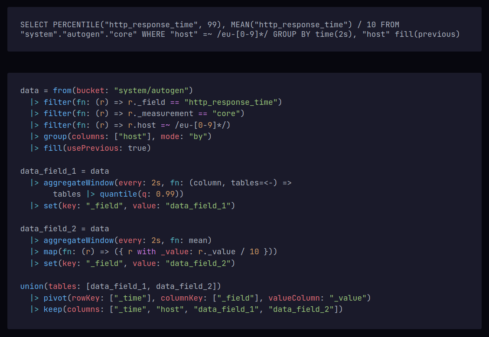

# InfluxQL to Flux transpiler

A transpiler for converting the legacy [InfluxDB](https://www.influxdata.com/products/influxdb/) v1 [InfluxQL](https://docs.influxdata.com/influxdb/v1.8/query_language/) queries to the new InfluxDB v2 [Flux](https://docs.influxdata.com/influxdb/latest/query-data/get-started/) queries.

*Note: Some InfluxQL functions/clauses and especially subqueries are currently not supported!*

## Further references

- [Getting started with Flux](https://docs.influxdata.com/influxdb/latest/query-data/get-started/)
- [Flux vs InfluxQL](https://docs.influxdata.com/influxdb/v1.8/flux/flux-vs-influxql/)
- [Complete list of Flux functions](https://docs.influxdata.com/flux/v0.x/stdlib/all-functions/)
